<!-- ░░░ PROFILE HEADER ░░░ -->
<table border="0" cellpadding="0" cellspacing="0">
<tr>
<td width="210" valign="top">

</td>
<td valign="top">

### Andrea Landini
**Credit Risk · Quantitative Finance · Markets**

M.Sc. Finance student at the Universität Liechtenstein, after a B.Sc. in
Economics and Finance at Bocconi. I work on credit risk and quantitative
finance, and I like turning stochastic calculus into tools that price and
measure risk.

</td>
</tr>
</table>

<!-- ░░░ LIVE TICKER ░░░ -->

---
 
## About

I focus on credit risk and quantitative finance: probability of default,
loss given default and exposure at default modelling, IFRS 9 expected credit
loss, derivative valuation and market risk. I spent six months at Deloitte in
the Financial Services audit practice, working on credit risk and IFRS 9 across
Banking and Capital Markets engagements, from PD, LGD and EAD estimates to ECL
staging and model validation.

What I enjoy most is building things that turn theory into numbers you can act
on, from stochastic pricing models to full loss distributions. The visuals
below trace that path in three steps: the mathematics of random processes,
the measurement of risk, and the pricing of credit.

---

## Foundations

It starts with randomness. These are the processes that everything downstream
is priced on, from Brownian motion to the jump models that capture defaults.

<table>
<tr>
<td width="50%"></td>
<td width="50%"></td>
</tr>
<tr>
<td align="center" colspan="2"></td>
</tr>
</table>

---

## Risk

Feed those paths into a book and you get a loss distribution. The work is then
measuring its tail with VaR and Expected Shortfall, and watching how risk moves
through time.

<table>
<tr>
<td width="50%"></td>
<td width="50%"></td>
</tr>
<tr>
<td width="50%"></td>
<td width="50%"></td>
</tr>
</table>

---

## Credit Markets

Apply the same machinery to issuers and you are pricing credit, across the
curve, the cross section, and decomposed into its drivers.

<table>
<tr>
<td width="50%"></td>
<td width="50%"></td>
</tr>
<tr>
<td align="center" colspan="2"></td>
</tr>
</table>

---

## Featured Project

**Credit Risk Analytics Dashboard** &nbsp;·&nbsp; [github.com/andrealandini/credit-risk-modeling](https://github.com/andrealandini/credit-risk-modeling)

A quantitative credit risk dashboard in Flask with nine interchangeable models
for PD, LGD and EAD (Expected Loss = PD × LGD × EAD), including Logistic
Regression, Merton Structural, Beta Regression and Markov Transition. It runs a
Monte Carlo portfolio engine (3,000 paths) on the Vasicek single factor model
with stochastic Beta LGD, and an ECB style stress testing module with baseline,
recession, stagflation and recovery scenarios.

---

## Languages and Libraries

**Languages**

**Libraries**

**Tools and Data**

---

## Interests

My work sits at the meeting point of finance, statistics and code. The themes
I keep coming back to:

- **Credit risk modelling**: PD, LGD, EAD, ECL under IFRS 9, and credit
  portfolio models such as Vasicek.
- **Market risk**: VaR, Expected Shortfall, GARCH volatility and dependency
  modelling with copulas.
- **Derivatives and pricing**: Black-Scholes, Heston, and Monte Carlo methods
  for valuation and simulation.
- **Regulation and resilience**: Basel III and IV capital frameworks and stress
  testing.
- **Building tools**: small quantitative web apps that I deploy and run on a VPS.

Away from the screen I work in three languages: Italian (native), English
(fluent) and German (B1).

---

The ticker uses <b>real</b> market data (Alpaca, free tier, refreshed daily).
All analytics are driven by <b>synthetic</b> data and are illustrative only.

